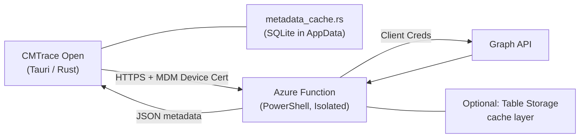

# EMM Metadata Ingestion System — Design Document

**Project:** CMTrace Open  
**Author:** Design draft for Adam Gell  
**Date:** 2026-03-14  
**Status:** Draft

---

## 1. Problem Statement

IME logs reference Win32 apps, WinGet apps, PowerShell scripts, proactive remediations, compliance policies, and configuration profiles by GUID only. CMTrace Open already extracts these GUIDs during log parsing (`event_tracker.rs`, `download_stats.rs`) and can resolve `AppId` → `ApplicationName` when the JSON payload is present in the log line — but that coverage is incomplete. Many GUIDs appear without inline display names, especially for policies, scripts, and remediations.

CMTrace Open should not take a direct dependency on Microsoft Graph API.

## 2. Design Goals

1. **No Graph dependencies in CMTrace Open.** The app never authenticates to Graph or stores Graph credentials.
2. **User-initiated sync.** Metadata fetch is an explicit UI action ("Sync Intune Metadata"), not triggered automatically during log parsing.
3. **Full IME entity coverage.** Win32 apps, WinGet apps, PowerShell scripts, proactive remediations, compliance policies, and configuration profiles.
4. **Device certificate authentication.** Leverages the Intune MDM device certificate already present on managed devices — no additional credentials required on the device side.
5. **Single tenant.** One Azure Function deployment per tenant. Multi-tenant is a future concern.
6. **Offline-first.** Once synced, metadata is cached locally. CMTrace Open resolves GUIDs from local cache during parsing without network access.

## 3. Architecture Overview



### Trust Model

1. **Azure Function** holds an app registration with application permissions (`DeviceManagementApps.Read.All`, `DeviceManagementConfiguration.Read.All`, `DeviceManagementManagedDevices.Read.All`). Graph credentials never leave the function.
2. **Device** authenticates to the Azure Function using the **Intune MDM device certificate** (issued by `Microsoft Intune MDM Device CA`, subject `CN=<INTUNE_DEVICE_ID>`). The function validates the certificate chain against the known Intune root CA and sub-CA — same pattern as the nosari20 reference architecture.
3. **CMTrace Open** calls the Azure Function over HTTPS with the device cert attached. It receives a JSON metadata payload. It never sees Graph tokens.

### Why Not Proactive Remediations?

Proactive Remediations push metadata on a schedule (typically 1–24 hr), which introduces drift the moment an app is assigned or removed. The user-initiated pull model guarantees freshness at the point of use with zero device-side state management.

---

## 4. Azure Function Design

### 4.1 Endpoint

```
POST https://<function-app>.azurewebsites.net/api/metadata?action=sync
```

Client certificate mode: **Require** (Azure Function App → Configuration → General settings).

### 4.2 Authentication Flow

Same pattern as the nosari20 reference (`Check-Certificate` / `Read-DeviceId`):

1. Client sends request with Intune MDM device certificate.
2. Azure Function receives certificate via `X-ARR-ClientCert` header.
3. Function validates the certificate chain against the hardcoded Intune Root CA and MDM Device CA.
4. Function extracts the Intune Device ID from the certificate subject (`CN=<DEVICE_ID>`).
5. **Optional:** Function validates the device ID exists in Intune via Graph before returning data (prevents use of revoked/wiped device certs).

### 4.3 Graph Queries

The function executes the following Graph API calls server-side and assembles a unified metadata response:

| Entity Type             | Graph Endpoint (v1.0)                                                                                                  | Key Fields                         |
| ----------------------- | ----------------------------------------------------------------------------------------------------------------------- | ---------------------------------- |
| Win32 Apps              | `/deviceAppManagement/mobileApps?$filter=isof('microsoft.graph.win32LobApp')&$select=id,displayName,publisher,fileName` | id, displayName, publisher         |
| WinGet Apps             | `/deviceAppManagement/mobileApps?$filter=isof('microsoft.graph.winGetApp')&$select=id,displayName,packageIdentifier`     | id, displayName, packageIdentifier |
| PowerShell Scripts      | `/deviceManagement/deviceManagementScripts?$select=id,displayName,fileName,runAsAccount`                                 | id, displayName, fileName          |
| Proactive Remediations  | `/deviceManagement/deviceHealthScripts?$select=id,displayName,publisher,isGlobalScript`                                  | id, displayName, publisher         |
| Device Configurations   | `/deviceManagement/deviceConfigurations?$select=id,displayName,description`                                              | id, displayName                    |
| Settings Catalog        | `/deviceManagement/configurationPolicies?$select=id,name,description,templateReference`                                  | id, name                           |
| Compliance Policies     | `/deviceManagement/deviceCompliancePolicies?$select=id,displayName`                                                      | id, displayName                    |

**Verification note:** All endpoints above are v1.0 GA. `configurationPolicies` was promoted to v1.0 more recently — confirm availability against the tenant's license tier before deployment. Each query should handle `@odata.nextLink` pagination for tenants with > 100 entities per type.

### 4.4 Response Contract

```jsonc
{
  "schemaVersion": 1,
  "tenantId": "11111111-2222-3333-4444-555555555555",
  "syncedUtc": "2026-03-14T16:00:00Z",
  "deviceId": "abcdefab-1111-2222-3333-abcdefabcdef",
  "entities": {
    "win32Apps": [
      { "id": "guid", "displayName": "7-Zip 24.09", "publisher": "Igor Pavlov", "fileName": "7z2409-x64.intunewin" }
    ],
    "winGetApps": [
      { "id": "guid", "displayName": "Visual Studio Code", "packageIdentifier": "Microsoft.VisualStudioCode" }
    ],
    "scripts": [
      { "id": "guid", "displayName": "Set-TimeZone", "fileName": "Set-TimeZone.ps1", "runAsAccount": "system" }
    ],
    "remediations": [
      { "id": "guid", "displayName": "Stale Profile Cleanup", "publisher": "Microsoft", "isGlobalScript": false }
    ],
    "deviceConfigurations": [
      { "id": "guid", "displayName": "Win11 - Endpoint Protection" }
    ],
    "settingsCatalog": [
      { "id": "guid", "name": "Win11 - Browser Hardening", "templateFamily": "endpointSecurityAntivirus" }
    ],
    "compliancePolicies": [
      { "id": "guid", "displayName": "Win11 - Compliance Baseline" }
    ]
  }
}
```

### 4.5 Azure Function Implementation Skeleton

The function reuses the certificate validation pattern from the nosari20 reference. The metadata assembly is additive — each Graph call is independent, so a failure in one entity type does not block the others.

```powershell
# run.ps1 — Metadata sync endpoint (abbreviated)
Using namespace System.Net

Param($Request, $TriggerMetadata)

# 1. Validate device certificate (same Check-Certificate / Read-DeviceId pattern)
$DeviceId = Read-DeviceId

# 2. Authenticate to Graph (app registration, client credentials)
$Bearer = Get-GraphAPIToken

# 3. Assemble metadata — each call is independent, failures are isolated
$Metadata = @{
    schemaVersion = 1
    tenantId      = $TenantId
    syncedUtc     = (Get-Date -Format 'o')
    deviceId      = $DeviceId
    entities      = @{
        win32Apps            = Get-Win32Apps -Bearer $Bearer
        winGetApps           = Get-WinGetApps -Bearer $Bearer
        scripts              = Get-Scripts -Bearer $Bearer
        remediations         = Get-Remediations -Bearer $Bearer
        deviceConfigurations = Get-DeviceConfigurations -Bearer $Bearer
        settingsCatalog      = Get-SettingsCatalog -Bearer $Bearer
        compliancePolicies   = Get-CompliancePolicies -Bearer $Bearer
    }
}

# 4. Return JSON
Push-OutputBinding -Name Response -Value ([HttpResponseContext]@{
    StatusCode  = [HttpStatusCode]::OK
    Body        = ($Metadata | ConvertTo-Json -Depth 10)
    ContentType = 'application/json'
})
```

---

## 5. CMTrace Open Integration

### 5.1 New Module: `src-tauri/src/intune/metadata_cache.rs`

A local SQLite database in the app's data directory stores synced metadata. The cache is queried during GUID resolution — no network call required at parse time.

**Schema:**

```sql
CREATE TABLE IF NOT EXISTS metadata_sync (
    id          INTEGER PRIMARY KEY,
    tenant_id   TEXT NOT NULL,
    synced_utc  TEXT NOT NULL,
    device_id   TEXT
);

CREATE TABLE IF NOT EXISTS entity_metadata (
    guid           TEXT PRIMARY KEY,
    entity_type    TEXT NOT NULL,
    display_name   TEXT NOT NULL,
    publisher      TEXT,
    file_name      TEXT,
    extra_json     TEXT,
    synced_utc     TEXT NOT NULL
);

CREATE INDEX IF NOT EXISTS idx_entity_type ON entity_metadata(entity_type);
```

`entity_type` values: `win32App`, `winGetApp`, `script`, `remediation`, `deviceConfiguration`, `settingsCatalog`, `compliancePolicy`.

`extra_json` stores overflow fields as JSON (packageIdentifier, runAsAccount, templateFamily, isGlobalScript, etc.) to avoid schema changes when new entity types or fields are added.

**Key operations:**

| Operation          | When                                  | Signature                                                             |
| ------------------ | ------------------------------------- | --------------------------------------------------------------------- |
| `resolve_guid`     | GUID resolution during event extraction | `fn resolve_guid(guid: &str) -> Option<EntityMetadata>`               |
| `upsert_sync`      | After a successful Azure Function call | `fn upsert_sync(response: &MetadataSyncResponse) -> Result<SyncStats, String>` |
| `get_last_sync`    | UI displays "Last synced: 2 hours ago" | `fn get_last_sync() -> Option<SyncInfo>`                              |
| `clear_cache`      | User resets metadata                  | `fn clear_cache() -> Result<(), String>`                              |
| `export_to_json`   | Evidence bundle export                | `fn export_to_json() -> Result<String, String>`                       |
| `import_from_json` | Bundle-aware offline resolution       | `fn import_from_json(json: &str) -> Result<SyncStats, String>`        |

### 5.2 New Module: `src-tauri/src/intune/metadata_sync.rs`

Handles the HTTPS call to the Azure Function using the Intune MDM device certificate.

**Certificate discovery (Windows only):**

The app already has `winreg` as a dependency and the dsregcmd module (`commands/dsregcmd.rs`) demonstrates Windows API usage for certificate verification (`WinVerifyTrust`, `CryptCATAdmin*`). The metadata sync module follows the same platform-gated pattern:

```rust
// Platform-gated behind cfg(target_os = "windows")
#[cfg(target_os = "windows")]
fn find_intune_mdm_certificate() -> Result<CertificateContext, String> {
    // 1. Open LocalMachine\My store via CertOpenStore
    // 2. Enumerate certificates
    // 3. Filter by issuer = "Microsoft Intune MDM Device CA"
    // 4. Extract subject CN as device ID (same pattern as nosari20 reference)
    // 5. Return cert context for use in HTTPS mutual TLS
}

#[cfg(not(target_os = "windows"))]
fn find_intune_mdm_certificate() -> Result<CertificateContext, String> {
    Err("Intune metadata sync requires Windows with an enrolled MDM certificate.".to_string())
}
```

**HTTPS client with client cert:**

The `reqwest` crate (already in the dependency tree via Tauri) supports client certificates through `reqwest::Identity`. The implementation needs to bridge the Windows cert store handle to a PKCS#12 identity that reqwest can consume. Two approaches:

1. **Preferred:** Use `PFXExportCertStoreEx` to export the cert + private key to an in-memory PKCS#12 blob, then pass to `reqwest::Identity::from_pkcs12_der`. This avoids writing key material to disk.
2. **Fallback:** Use the `native-tls` crate directly with `SChannel` on Windows, which can reference the cert by store handle without export. This requires bypassing reqwest's TLS abstraction.

**Verification note:** Approach 1 requires the private key to be exportable. The Intune MDM device certificate's private key is typically TPM-backed and may not be exportable via `PFXExportCertStoreEx`. If this is the case, approach 2 (SChannel with store handle) or a Windows HTTP API call (`WinHttpSetOption` with `WINHTTP_OPTION_CLIENT_CERT_CONTEXT`) would be necessary. **This is the primary technical risk and needs a spike before implementation.**

### 5.3 New Tauri Commands: `src-tauri/src/commands/metadata.rs`

```rust
/// Trigger a metadata sync from the Azure Function.
/// User-initiated — called from a UI button.
#[tauri::command]
pub async fn sync_intune_metadata(
    function_url: String,
) -> Result<MetadataSyncResult, String> { ... }

/// Resolve a GUID to its display name from the local cache.
#[tauri::command]
pub fn resolve_metadata_guid(guid: String) -> Result<Option<EntityMetadata>, String> { ... }

/// Get the last sync timestamp and entity counts.
#[tauri::command]
pub fn get_metadata_sync_status() -> Result<MetadataSyncStatus, String> { ... }

/// Clear the local metadata cache.
#[tauri::command]
pub fn clear_metadata_cache() -> Result<(), String> { ... }
```

Register in `src-tauri/src/commands/mod.rs` and `src-tauri/src/lib.rs` alongside existing command handlers.

### 5.4 Integration Points in Existing Code

The metadata cache slots into the existing parsing pipeline at name resolution time, not parse time. This keeps the "Sync Intune Metadata" action decoupled from log parsing performance.

**`event_tracker.rs` → `build_event_name()` and `build_source_specific_name()`**

Currently, GUID-bearing events get names like `"AppWorkload Download (a1b2c3d4...)"` via `short_guid()`. After integration:

```rust
// In build_appworkload_name or build_source_specific_name:
let resolved_label = guid.as_deref()
    .and_then(|g| metadata_cache::resolve_guid(g))
    .map(|meta| meta.display_name.clone())
    .unwrap_or_else(|| short_guid(guid.as_deref().unwrap_or("unknown")).to_string());

// Produces: "AppWorkload Download (7-Zip 24.09)" instead of "AppWorkload Download (a1b2c3d4...)"
```

This change touches `build_appworkload_name()`, `build_source_specific_name()` for AppActionProcessor / AgentExecutor / HealthScripts, and the generic `build_event_name()` fallback path.

**`download_stats.rs` → `extract_display_name()`**

If JSON payload extraction (`extract_json_field` for `ApplicationName`) returns `None`, check the cache before falling back to `short_id()`:

```rust
fn extract_display_name(msg: &str) -> Option<String> {
    // Existing JSON extraction logic ...
    // If no display name found inline, try cache:
    extract_content_id(msg)
        .and_then(|guid| metadata_cache::resolve_guid(&guid))
        .map(|meta| meta.display_name)
}
```

**`commands/intune.rs` → diagnostics evidence text**

`build_diagnostics()`, `top_event_labels()`, and `top_failed_download_labels()` reference `event.name` and `download.name` — both of which would already carry resolved names from the upstream changes. No direct modification needed in the diagnostics module.

**No changes needed in:**

- `timeline.rs` — names flow through from event_tracker
- `ime_parser.rs` — parsing is format-level, not resolution-level
- React frontend — GUIDs already display inline via `event.name`; resolved names replace them transparently

### 5.5 Configuration

The Azure Function URL needs to be user-configurable. Stored in the app's config directory alongside the existing `file-association-preferences.json`:

```json
// metadata-sync-config.json
{
  "functionUrl": "https://contoso-metadata.azurewebsites.net/api/metadata",
  "autoPromptOnUnresolvedGuids": false
}
```

Read/write via a new settings command pair, same pattern as `read_file_association_preferences` / `write_file_association_preferences` in `commands/file_association.rs`.

### 5.6 Evidence Bundle Integration

When analyzing an evidence bundle, the metadata cache can be included as an artifact:

```
evidence/
  metadata/
    intune-metadata.json    ← exported MetadataSyncResponse
```

The `resolve_intune_input()` path in `commands/intune.rs` already scans evidence bundle entry points. Adding `evidence/metadata` as a recognized location would let the analysis pipeline call `metadata_cache::import_from_json()` automatically when a bundle includes pre-exported metadata — enabling offline GUID resolution on a different machine.

### 5.7 Dependency Additions

| Crate      | Purpose              | Notes                                                     |
| ---------- | -------------------- | --------------------------------------------------------- |
| `rusqlite` | Local metadata cache | Feature: `bundled` (ships SQLite, no system dependency)   |

`reqwest` is already in the dependency tree via Tauri. If SQLite feels too heavy for Phase 1, a JSON file in `app_config_dir` is a viable alternative — the entity count per tenant is typically < 500 rows.

---

## 6. UI Integration

### 6.1 Sync Trigger

A "Sync Intune Metadata" action accessible from:

- The app toolbar (primary)
- The Tools menu (secondary)
- The Intune diagnostics view header (contextual)

The action:

1. Reads the configured Azure Function URL from settings.
2. Calls `sync_intune_metadata` (Tauri command).
3. Displays progress/result: entity counts synced, timestamp, any errors.

### 6.2 Resolution Behavior

| State           | Behavior                                                                                                         |
| --------------- | ---------------------------------------------------------------------------------------------------------------- |
| Cache populated | GUIDs in timeline, diagnostics, and downloads show resolved display names (e.g., "AppWorkload Download (7-Zip 24.09)") |
| Cache empty     | Current behavior — short GUID labels. No degradation.                                                           |
| Cache stale     | Resolved names still display; staleness indicator shows "Last synced: 3 days ago"                              |

### 6.3 Staleness Indicator

The UI shows "Last synced: <relative time>" in the Intune diagnostics header or a dedicated metadata status bar. If > 7 days stale, the indicator shifts to a warning color. If the user opens logs with many unresolved GUIDs and no cache is present, a non-blocking prompt suggests syncing.

---

## 7. Implementation Phases

### Phase 1: Azure Function + Local Cache (MVP)

1. Deploy the Azure Function with cert auth and Graph queries for Win32 apps, WinGet apps, scripts, and remediations.
2. Add `metadata_cache.rs` (SQLite or JSON file cache).
3. Spike: Validate Windows cert store → reqwest client cert bridging. Resolve the TPM-backed key exportability question.
4. Add `metadata_sync.rs` (Windows cert discovery + HTTPS call).
5. Add Tauri commands and wire to a minimal "Sync Metadata" button.
6. Integrate `resolve_guid()` into `event_tracker.rs` → `build_event_name()`.

**Deliverable:** User clicks "Sync Metadata", GUIDs in the timeline show display names.

### Phase 2: Enriched Resolution + Bundles

1. Add device configuration, Settings Catalog, and compliance policy entity types to the function.
2. Integrate cache into `download_stats.rs` for content ID → app name mapping.
3. Add metadata export/import for evidence bundles.
4. Add Graph pagination handling in the function for large tenants.

### Phase 3: Settings, Polish, Caching

1. Settings panel for Azure Function URL configuration.
2. Auto-prompt when many unresolved GUIDs are detected.
3. Server-side caching (Azure Table Storage with 15-minute TTL) to protect against Graph throttling during mass device syncs.
4. Bundle-level metadata endpoint override via `manifest.json` → `intakeHints.metadataEndpoint`.

---

## 8. Security Considerations

| Concern                         | Mitigation                                                                                                                   |
| ------------------------------- | ---------------------------------------------------------------------------------------------------------------------------- |
| Graph credentials exposed to devices | Credentials live only in the Azure Function. Devices never see tokens.                                                   |
| Unauthorized metadata access    | Device cert validation ensures only Intune-enrolled devices can call the function.                                          |
| Revoked device cert reuse       | Optional: function validates device ID still exists in Intune before returning data.                                         |
| Function URL exposure           | URL is not secret (cert auth gates access), but should be treated as internal infrastructure.                                |
| Local cache tampering           | Cache is informational only (display names). Tampering affects readability, not security posture.                            |
| Private key export              | If using PFXExport approach: key material is held in memory only, never written to disk. If TPM-backed keys are non-exportable, the SChannel/WinHTTP approach avoids export entirely. |

---

## 9. Open Questions

1. **Windows cert store → reqwest bridging:** Can the Intune MDM device certificate's private key be exported to an in-memory PKCS#12 for reqwest, or is it TPM-protected and non-exportable? If non-exportable, the implementation needs SChannel or WinHTTP with cert context handle. **This is the primary technical risk.**
2. **Cache format decision:** SQLite (`rusqlite` with `bundled`) vs. JSON file for Phase 1. SQLite is more robust for querying and concurrent access, but JSON file is simpler for < 500 entities. Recommendation: start with JSON file, migrate to SQLite if query patterns demand it.
3. **Graph pagination:** For tenants with > 100 entities per type, the function needs `@odata.nextLink` handling. Standard pattern, but needs implementation and testing against a representative tenant.
4. **Rate limiting:** If many devices sync simultaneously, the function's Graph calls may hit throttling. Server-side caching (Azure Table Storage with a 15-minute TTL) is the Phase 3 mitigation.
5. **Non-Windows platforms:** macOS Intune-enrolled devices have a different certificate store path. Linux is not relevant for Intune MDM. Phase 1 is Windows-only; macOS support is a future concern.
6. **Intune MDM Device CA certificate expiry:** The hardcoded CA certs in the nosari20 reference show a 2021–2026 validity window for the root CA. Microsoft will eventually rotate these. The function should be prepared to update the trusted CA chain when this happens — either via configuration or by fetching the current CA from a known Microsoft endpoint.
